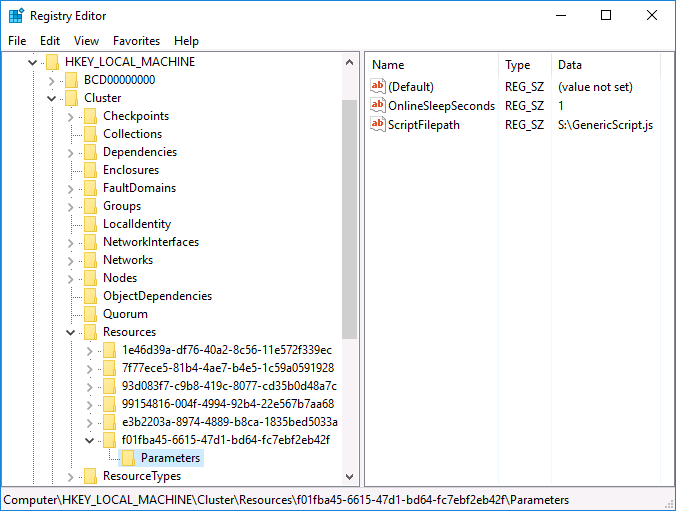

# Sample script for generic script resource in Windows Server Failover Cluster

## Wait time in Online call

The Online call handler in this script has the wait time capability. You can set the wait time in seconds via OnlineSleepSeconds resource parameter using regedit.exe.

## Cluster log

This script writes some logs into the cluster log.
